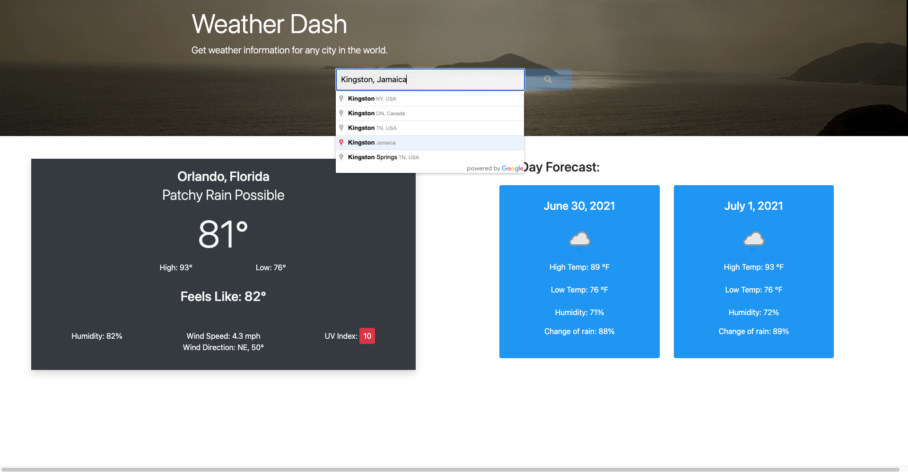

# Weather_Dashboard

> This Web Application allows user to get current and two day weather forecast. Simply type in a city name or zip code. Don't know where you are? Click the 'search weather near me' button to get the current weather data near you. 

### Table of Contents

- [Description](#description)
- [Technologies](#technologies)
- [How To Use](#how-to-use)
- [Links](#links)
- [Author Info](#author-info)

---

## Description

This Web Application allows user to get current and two day weather forecast. Simply type in a city name or zip code. The user can also click the 'search weather near me' button to get the current weather data nearby. This was accomplished using HTML, CSS, Javascript, and Bootstrap. Google places API auto completes the user inputs. Weatherapi.com was used as the data source. JavaScripts geolocation is used to get the coordinates for the user. See [How To Use](#how-to-use) section for an explanation of how it works.

Overall a fun and challenging project. I came away with a better understanding of incorporating APIs into a website.

#### Technologies

- HTML
- CSS
- Javascript
- Jquery
- APIs(google places, weather api)

[Back To The Top](#read-me-template)

---

## How To Use

1. Type your city or zip code into the text input. Google auto       complete will help find a suitable place. 
2. Press click on the search button.
3. The application will then give you the current date, weather details, and a five day weather forecast.
4. Simply type in another city to view somewhere else.  
5. Try using the 'Search Weather Near Me' button to get the weather for a city near you.  
   [Back To The Top](#read-me-template)

---

## Links

Link to site:
https://deleonfrancis.github.io/Weather_Dashboard/

Link to GitHub repository:
https://github.com/deleonfrancis/Weather_Dashboard

[Back To The Top](#read-me-template)

---

## Author Info

- E-mail: dxfrancis.coding@gmail.com

[Back To The Top](#read-me-template)
